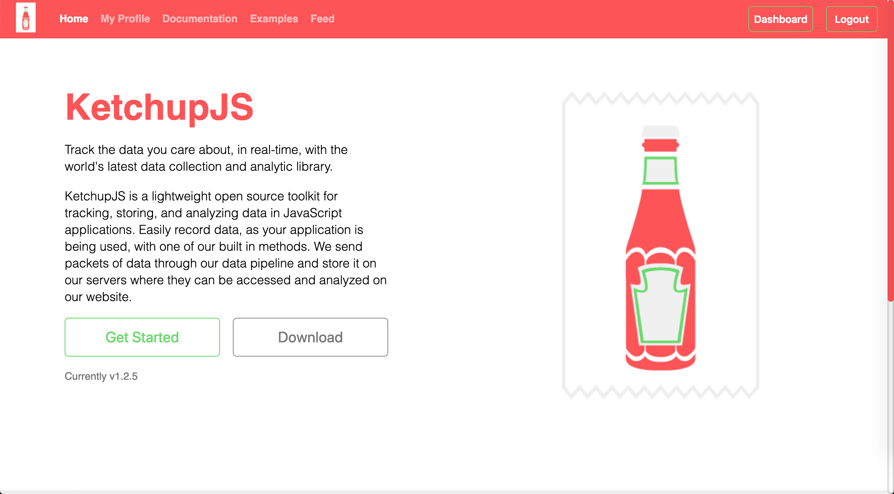
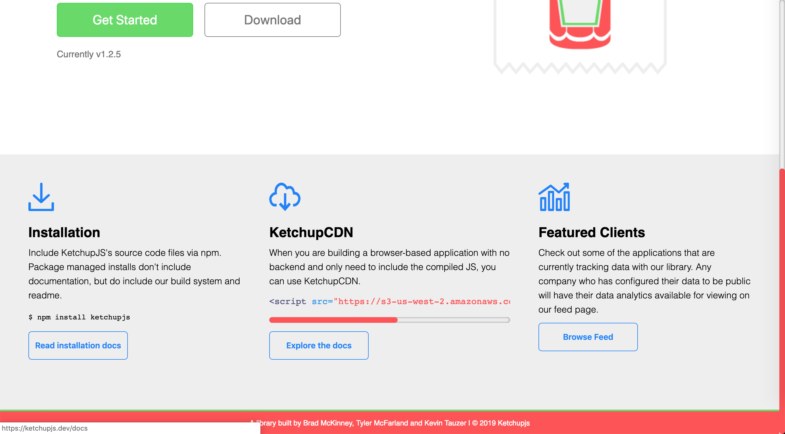
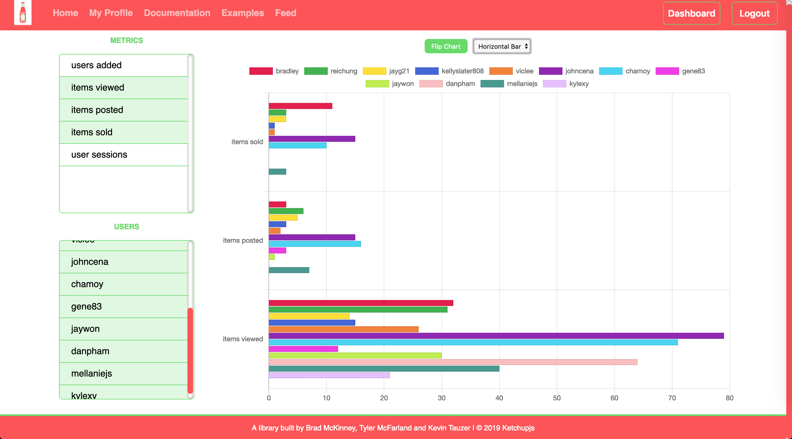
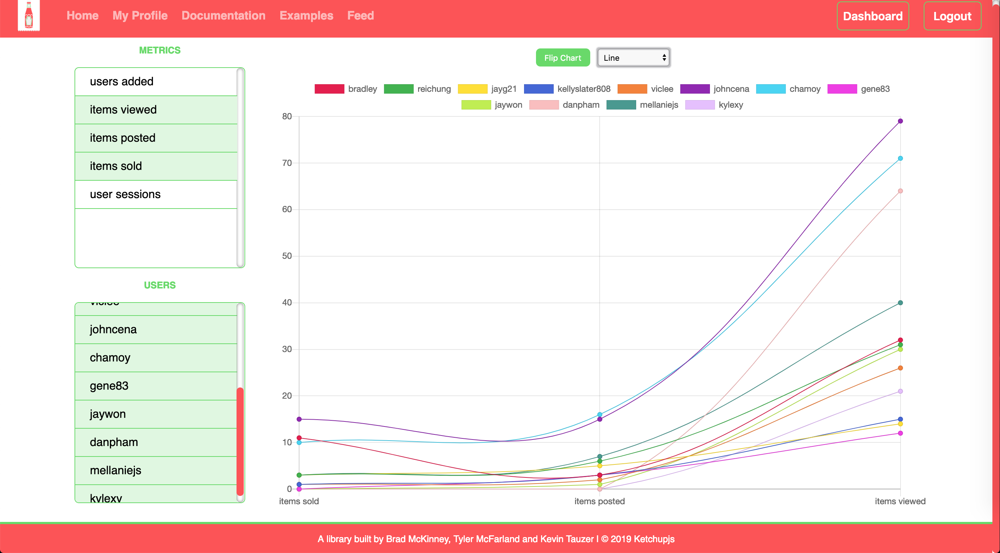

# KetchupJS

KetchupJS is a lightweight B2B tool for tracking and analyzing data. This repository is the frontend website to 
accompany our library, which is published on [npmjs.com](npmjs.com)

## Features

- Full authentication & Password encryption
- Data Visualization
- React Hooks & Animation
- Accessible Modals
- Client-side & Server-side Session Management
- Search filtering

## Technologies & Frameworks

* React
* React-router
* Redux
* Redux-thunk
* AWS
* Chart.js
* Express
* Express Session
* Redis
* Passport.js
* Bcryptjs
* Bookshelf.js
* Knex.js
* PostgreSQL
* Docker
* Sass

## How to use?

Our website can be found at [https://www.ketchupjs.dev](https://www.ketchupjs.dev)

For information on how to use our library you can find documentation and examples on our website or
on npmjs.com where our library is published, at [https://www.npmjs.com/package/ketchupjs](https://www.npmjs.com/package/ketchupjs)

## Screenshots

___

___

___

